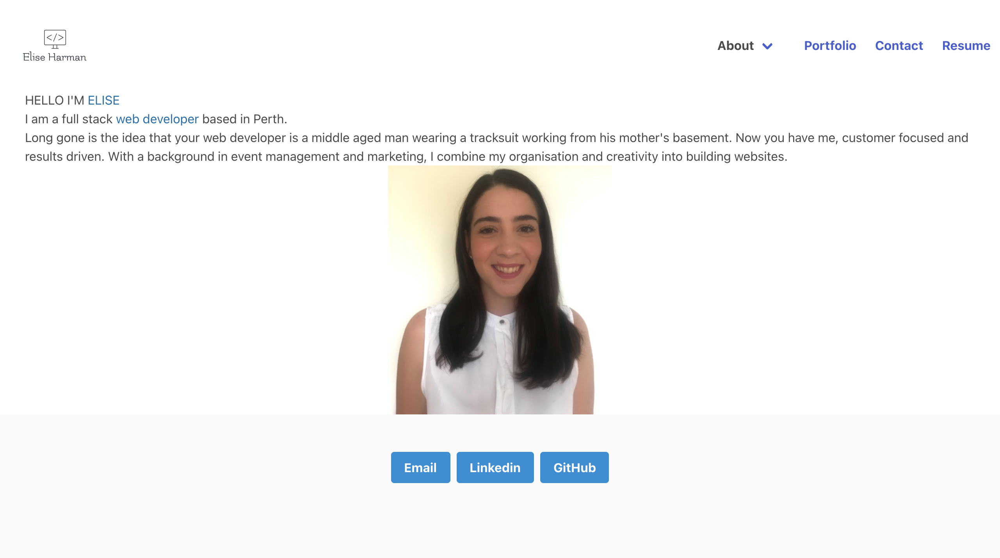
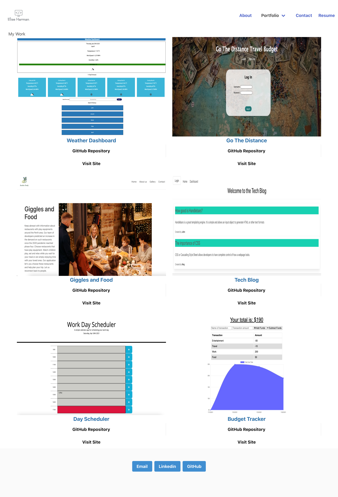
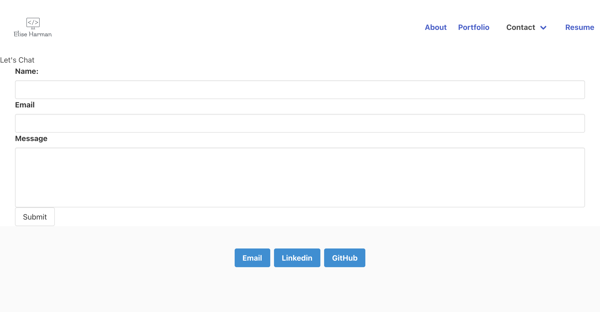
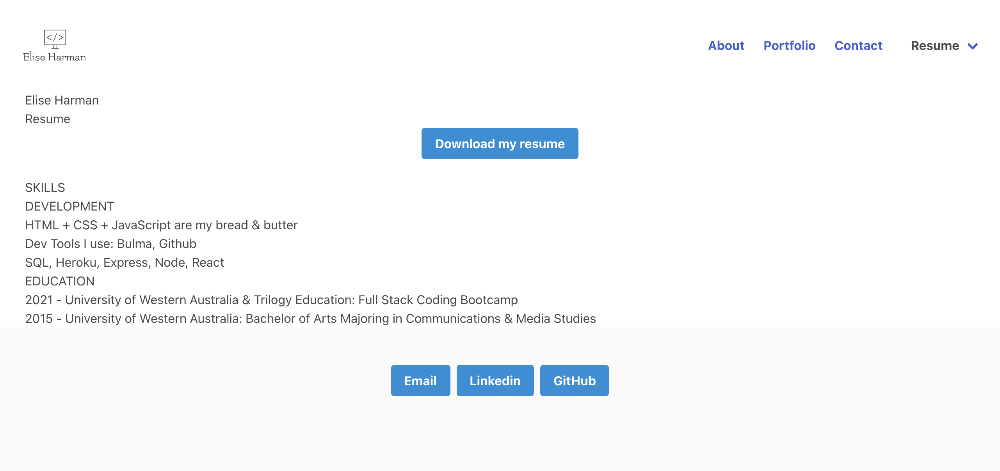

# React Portfolio

## Description

A portfolio that showcases my work over a 6 month full stack coding bootcamp conducted by the University of Western Australia and Trilogy Education

The following technologies were used to create this application

- React
- React-Hook-Form
- Bulma

## Table of Contents

- [Live application](#liveapplication)
- [Resources](#resources)
- [Questions](#questions)

## Live Application

[Link to deployed portfolio](https://harmane4.github.io/Elise-Harman-Portfolio/)

## License

[MIT](https://choosealicense.com/licenses/mit/)

Copyright (c) 2021 Elise Harman

## Resources

- [Create React App](https://github.com/facebook/create-react-app)

- [React Hook Forms](https://react-hook-form.com/)

## Questions

If you have any questions or would like to report and issue please contact me at my [GitHub](https://github.com/harmane4) or elise_harman@hotmail.com
